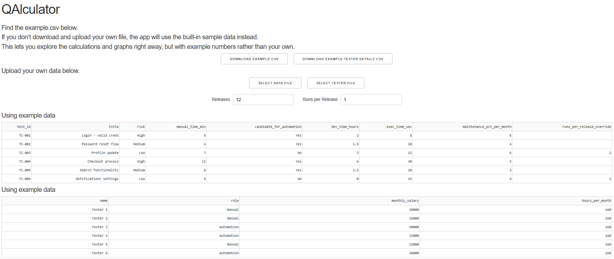
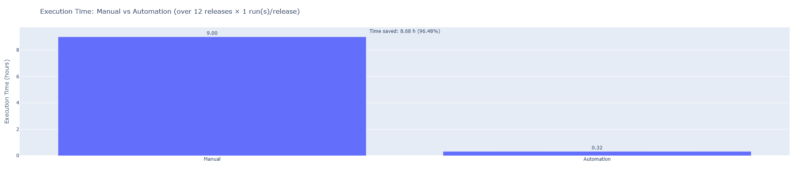

# QAlculator 🚀  

*A lightweight ROI calculator for Test Automation built with Python, Dash & Plotly.*  

---

## 📖 Overview  

QAlculator helps QA teams and developers understand the **return on investment (ROI)** of automation testing compared to manual testing.  

It takes a simple dataset of your test cases (or uses the included sample data) and generates **interactive graphs** that highlight:  
- 📊 Manual vs Automation **cost comparison**  
- ⏱️ **Execution time savings** with automation  
- 📈 ROI growth over multiple releases/runs  
- ⚖️ The **break-even point** where automation starts paying off  

---

## 🖼️ Screenshots / Demo  

- 
- 
- 

---

## ⚡ Features  

- Upload your own CSV of test cases **or** use the sample dataset  
- Validates your data against the expected schema  
- Generates dynamic tabs for different graphs  
- Clean, interactive charts with **Plotly**  
- Built using **Dash** for a simple, modern web interface  

---

## 📂 Example Data  

There are two example files included:  
1. **`testcases.csv`** → test details (manual execution time, automation dev time, risk, etc.)  
2. **`testers.csv`** → tester pool (role, monthly salary, hours per month)  

These are used to calculate costs and ROI.  

---

## 🛠️ Installation & Setup  

```bash
# 1. Clone the repo
git clone https://github.com/<your-username>/qalculator.git
cd qalculator

# 2. Create a virtual environment
python -m venv venv
source venv/bin/activate   # (Linux/macOS)
venv\Scripts\activate      # (Windows)

# 3. Install dependencies
pip install -r requirements.txt

# 4. Run the app
python app.py
